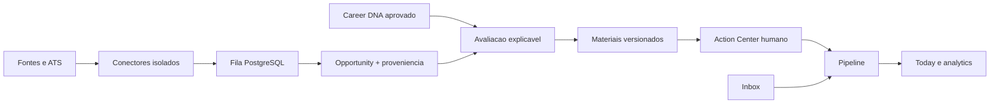
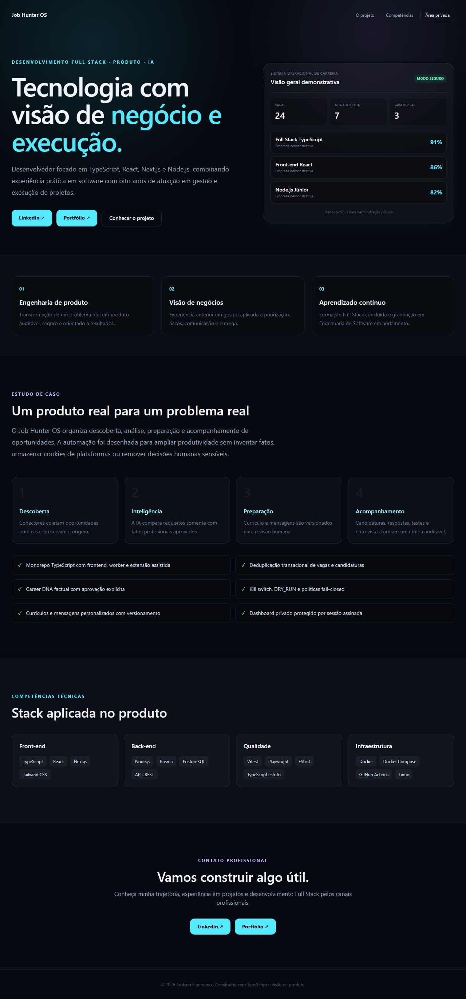
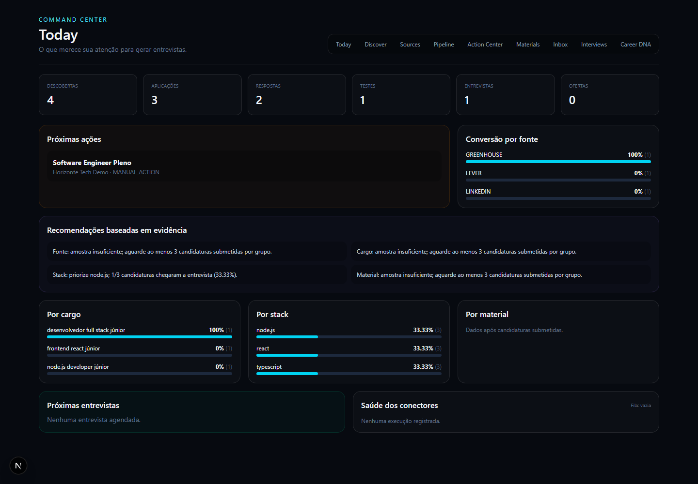
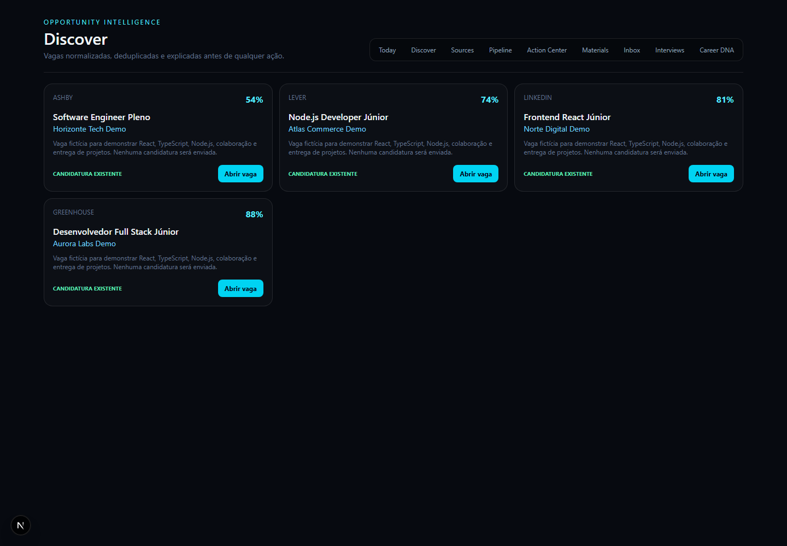
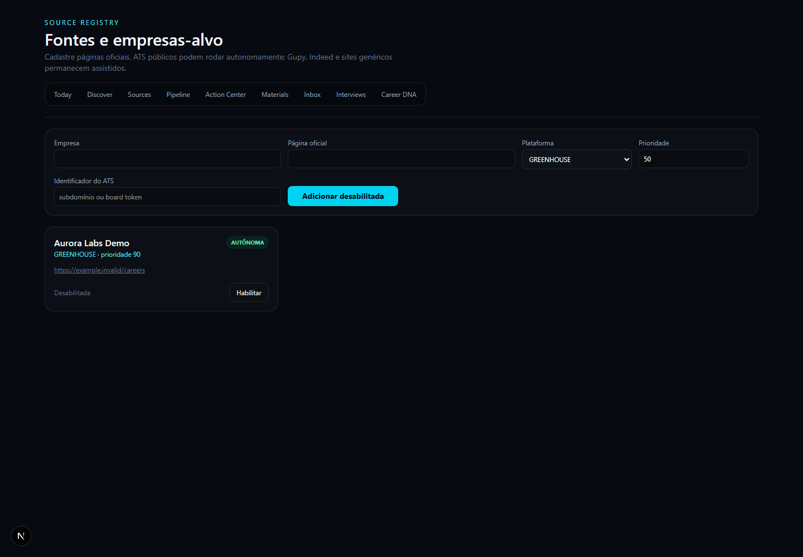

# Job Hunter OS

Plataforma pessoal de inteligencia de oportunidades: descobre vagas, consolida fontes, explica compatibilidade, prepara materiais factuais e organiza cada proxima acao ate a entrevista.

> O sistema automatiza pesquisa e preparacao. Formularios exigem confirmacao humana e testes nunca enviam candidaturas reais.

## Destaques

- conectores resilientes para GitHub, LinkedIn e ATS publicos;
- deduplicacao com URL canonica e fingerprint;
- Career DNA com aprovacao explicita de fatos;
- score explicavel, ranking e requisitos essenciais/desejaveis;
- curriculos e mensagens personalizados, imutaveis e versionados;
- Action Center e extensao assistida sem armazenamento de cookies;
- inbox, follow-up controlado e Interview Room;
- dashboard com funil e conversao por fonte.

## Stack

TypeScript, Node.js, Prisma, PostgreSQL, Playwright, Puppeteer, Next.js, Tailwind CSS e Docker Compose.

## Arquitetura

## Produto em execução

### Portfólio público sanitizado

A rota `/portfolio` apresenta o estudo de caso sem consultar o banco operacional e sem expor vagas, candidaturas, mensagens, salários ou credenciais.

## Execucao local

1. Copie os exemplos de ambiente e preencha somente os valores locais necessarios.
2. Mantenha `DRY_RUN=true` ate concluir a validacao.
3. Suba o PostgreSQL: `docker compose up -d postgres`.
4. Aplique as migrations do backend.
5. Execute `powershell -ExecutionPolicy Bypass -File scripts/verify.ps1`.
6. Inicie frontend e backend apenas quando a politica operacional estiver revisada.

Consulte [DOCUMENTATION.md](DOCUMENTATION.md), [arquitetura](docs/ARCHITECTURE.md), [seguranca](docs/SECURITY.md), [runbook](docs/RUNBOOK.md) e [demonstracao](docs/DEMO.md).

## Estado do projeto

O progresso verificavel, gates e pendencias ficam em [CHECKLIST.md](CHECKLIST.md). Evidencias de cada etapa ficam em [docs/PROGRESS.md](docs/PROGRESS.md).

## Privacidade

Arquivos `.env`, dumps, logs e dados pessoais nao pertencem ao repositorio. Credenciais de e-mail e IA devem ter menor privilegio, limite de gasto e rotacao periodica.
